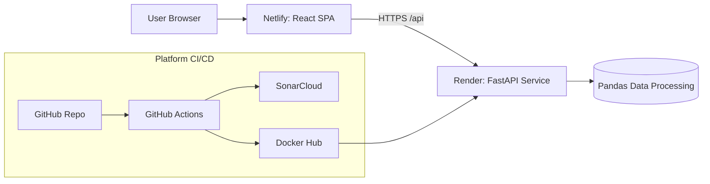

# InsightFlow: Production-Grade Full-Stack Data Analytics Platform

InsightFlow is a production-ready React + FastAPI platform where users upload CSV data, apply backend filters, and visualize the resulting dataset.

## 🚀 Product Features

- CSV upload API with validation and size guardrails
- Server-side filtering operators: `equals`, `contains`, `greater_than`, `less_than`
- Responsive visualization dashboard powered by Recharts
- Frontend tests with Jest + Testing Library
- Backend tests with pytest + FastAPI TestClient

## 🧱 Repository Structure

```text
.
├── .github/workflows/ci.yml
├── backend/
│   ├── app/
│   │   ├── __init__.py
│   │   └── main.py
│   ├── tests/
│   │   └── test_api.py
│   └── requirements.txt
├── frontend/
│   ├── public/index.html
│   ├── src/
│   │   ├── __tests__/App.test.jsx
│   │   ├── components/
│   │   ├── services/api.js
│   │   ├── App.jsx
│   │   ├── index.js
│   │   └── styles.css
│   └── package.json
├── Dockerfile
├── netlify.toml
├── render.yaml
├── sonar-project.properties
└── README.md
```

## 🏗️ Architecture Diagram



## 🔄 CI/CD Pipeline (GitHub Actions)

Workflow: `.github/workflows/ci.yml` (trigger: push to `main`).

### Stage Breakdown

1. Install frontend dependencies (`npm install`)
2. Run frontend unit tests (`npm test`)
3. Build frontend artifact (`npm run build`)
4. Install backend dependencies (`pip install -r requirements.txt`)
5. Run backend tests (`pytest`)
6. Build backend artifact check (`python -m compileall backend`)
7. SonarCloud scan (`SONAR_TOKEN`)
8. Build and push Docker image to Docker Hub (`DOCKER_USERNAME`, `DOCKER_PASSWORD`)
9. Trigger Render deploy hook (`RENDER_DEPLOY_HOOK_URL`)
10. Deploy frontend to Netlify if site/token secrets exist

## 🐳 Docker

- Multi-stage image:
  - Stage 1: React build on Node 20
  - Stage 2: FastAPI runtime on Python 3.12 slim

Local build:

```bash
docker build -t insightflow:local .
docker run -p 8000:8000 insightflow:local
```

## 🔐 Environment Variables & Secrets

### GitHub Actions Secrets

Required:

- `DOCKER_USERNAME`
- `DOCKER_PASSWORD`
- `SONAR_TOKEN`

Deployment:

- `RENDER_DEPLOY_HOOK_URL`
- `NETLIFY_AUTH_TOKEN`
- `NETLIFY_SITE_ID`

### App Runtime Variables

Backend (`backend/.env.example`):

- `ALLOWED_ORIGINS=https://your-netlify-site.netlify.app`
- `MAX_UPLOAD_SIZE_MB=10`

Frontend (`frontend/.env.example`):

- `REACT_APP_API_BASE_URL=https://your-render-backend.onrender.com`

## 🌍 Deployment Instructions

### Frontend → Netlify

1. Connect repository to Netlify.
2. Build config is already defined in `netlify.toml`.
3. Set `REACT_APP_API_BASE_URL` in Netlify environment variables.
4. Deploy production branch.

### Backend → Render

1. Create a Render Web Service from this repo.
2. Use Docker deployment (`Dockerfile` + `render.yaml`).
3. Configure backend env vars (`ALLOWED_ORIGINS`, `MAX_UPLOAD_SIZE_MB`).
4. Use `RENDER_DEPLOY_HOOK_URL` for automatic redeploy from GitHub Actions.

## ✅ Tests (Minimum Contract)

### Frontend (Jest)

`frontend/src/__tests__/App.test.jsx` includes real scenarios:

1. Upload flow updates stats from API response
2. Filter flow sends payload and updates row count

### Backend (pytest)

`backend/tests/test_api.py` includes endpoint and validation checks:

1. Health endpoint availability
2. Contains filter logic
3. Invalid numeric filter validation

## 🔗 Live URLs

- Frontend (Netlify): `https://your-netlify-site.netlify.app`
- Backend (Render): `https://your-render-backend.onrender.com`
- SonarCloud: `https://sonarcloud.io/project/overview?id=your-org_insightflow`
- Docker Hub: `https://hub.docker.com/r/<docker-username>/insightflow`

## 🖼️ Screenshots

Add deployed UI screenshots here:

- `docs/screenshots/dashboard.png`
- `docs/screenshots/upload-flow.png`
- `docs/screenshots/filter-results.png`
